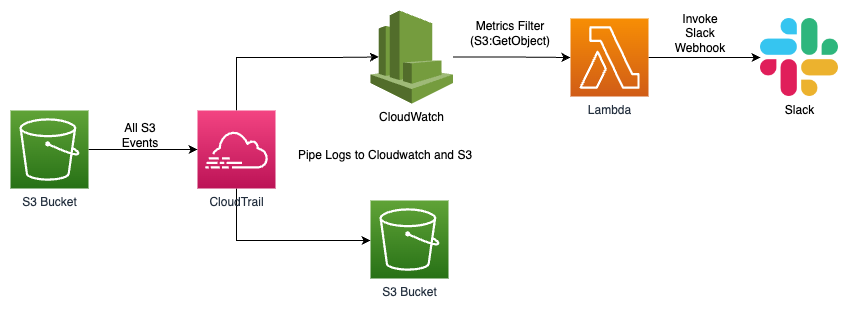

# terraform-alerts-s3-getobject
Terraform code to configure cloudtrail to monitor S3 actions and pipe logs to cloudwatch. Cloudwatch metric filter will trigger lambda to send alerts to slack

This terraform source code will provision a new cloudtrail trail - the trail will send S3 bucket data events to a 
logging S3 bucket and Cloudwatch log group. Create a lambda function that is trigger by cloudwatch events with 
metric filter configured - the lambda function will trigger a notification alert to Slack to indicate `s3:GetObject` 
action by unauthorized users/roles. 

## Architecture 

## Setup
1. Configure your AWS CLI to run terraform
2. Fill in the variables value in `dev.tfvars`
3. Run `terraform apply -var-file=dev.tfvars`

## Conclusion
You can read up more on the implementation over here - https://medium.com/@xinweiiiii/monitor-aws-s3-getobject-events-and-send-notification-to-slack-using-cloudtrail-lambda-89a8cb1122e9